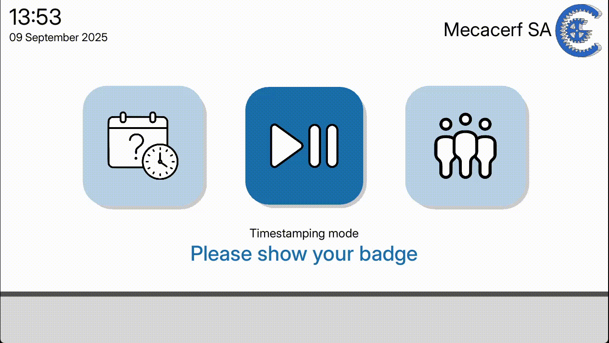
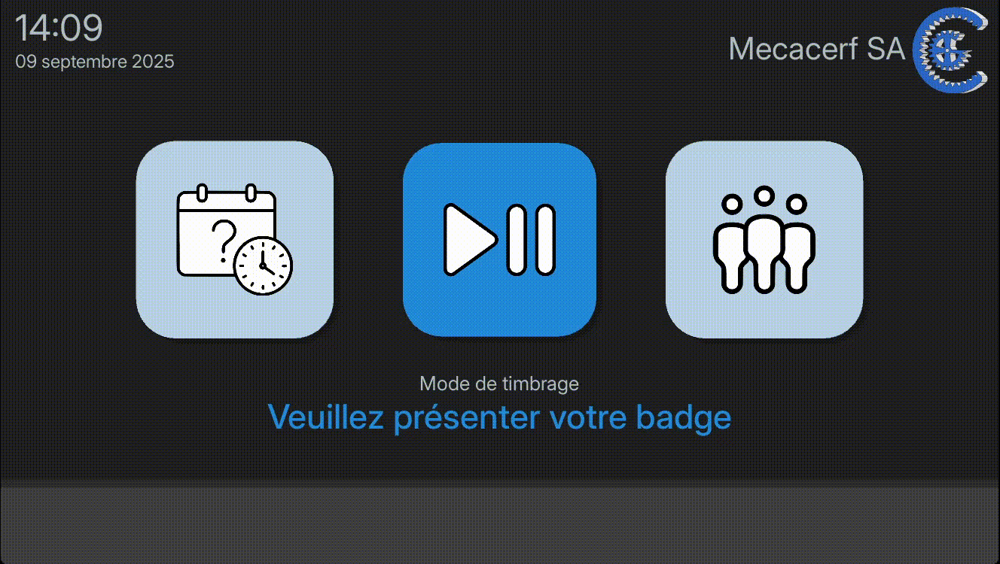

# ⏱️ Timestamping App

A simple, open-source timestamping application designed for small companies to track employee attendance, work hours, and absences.
Built with **Python** and **LibreOffice Calc** for maximum accessibility — no database required. Simply open an employee’s spreadsheet to view exactly what the application sees and processes.



*(Preview only — the internationalization module is still under development.)*

---

## ✨ Features
### ⏱️ Core functionality

- Clock in / clock out tracking
- Employee identification via barcode
- Handles midnight rollover for late shifts
- Automatically manages device sleep / wake

### 📊 Tracking & reporting

- Daily, monthly, and yearly balance tracking
- Vacation and absence management
- Attendance list verification
- Event reports by email
- Direct Excel exports for administrative reports

### ⚠️ Error detection

- Automatic detection and reporting of:
  - Missing clock in / out events
  - Data inconsistencies
  - Custom employee rules (e.g. uninterrupted work duration, min/max yearly balance)

### 🗄️ Data & infrastructure

- Data stored in simple Excel files (easy for HR to maintain)
- Ready to use for small teams without IT infrastructure
- Scales easily across multiple computers via a shared NAS repository

### 💻 User experience

- Clean and intuitive user interface, usable by anyone
- Works on any computer with a webcam
- Dark & light mode support




---

## 🚀 Getting Started

### ✅ Prerequisites
- [Python 3.13+](https://www.python.org/downloads/)  
- [LibreOffice](https://www.libreoffice.org/download/download/)  

> ⚠️ Currently only **Windows** is supported.  
> Linux support is planned for a future release.


### ▶️ Run (development mode)
```bash
# (Optional) create and activate a virtual environment
pip install -r requirements.txt
python src/main.py
```

### 🛠️ Build (Windows executable)

1. Clone the repository:
```bash
git clone https://github.com/Mecacerf/TeamBridge.git
cd TeamBridge/deploy
```

2. Run the build script
```bash
python build.py
```

3. Launch the app
    
    Double-click TeamBridge.exe inside `deploy/dist/`.


## 📖 Usage

Open one of the example spreadsheets in the `samples/` directory to get familiar with the format.  
It may look a bit complex at first, but you’ll quickly see there’s nothing mysterious about it.  
*Note: the sample file is currently in French — some adjustments may be needed for administrative reports.*

Create a copy of the spreadsheet for each employee and fill in their information.
It’s recommended to organize files into **folders by year**, which makes searching and archiving faster.

When you first launch the application, a `local_config.ini` file will be created with default settings.
You can open this file at any time to customize the configuration — for example, to specify a new folder for your spreadsheets.


## 🤝 Contributing

Contributions are very welcome!  
If you’d like to improve the project, fork the repository, create a feature branch, and open a pull request.
You can also check out the [issue tracker](../../issues) for ideas or to report bugs.


## 📜 License

This project is licensed under the **GNU Affero General Public License v3.0 (AGPL-3.0)**.  
See the [LICENSE](./LICENSE) file for full details.


## 🙌 Acknowledgments

This project was originally developed for [Mecacerf SA](https://mecacerf.ch/) as an internal time-tracking solution, and has been open-sourced to benefit others. It’s the company’s only time-tracking tool and is used daily by over 15 people.


## 📬 Contact

Have questions or need help setting things up?  
Feel free to reach out via [GitHub Issues](../../issues) or [Discussions](../../discussions) — I’ll respond as soon as possible.
